# Tutorial 7

<b>Performance Testing Results</b>

## Performance Testing Results

### all-student

#### View Results Tree
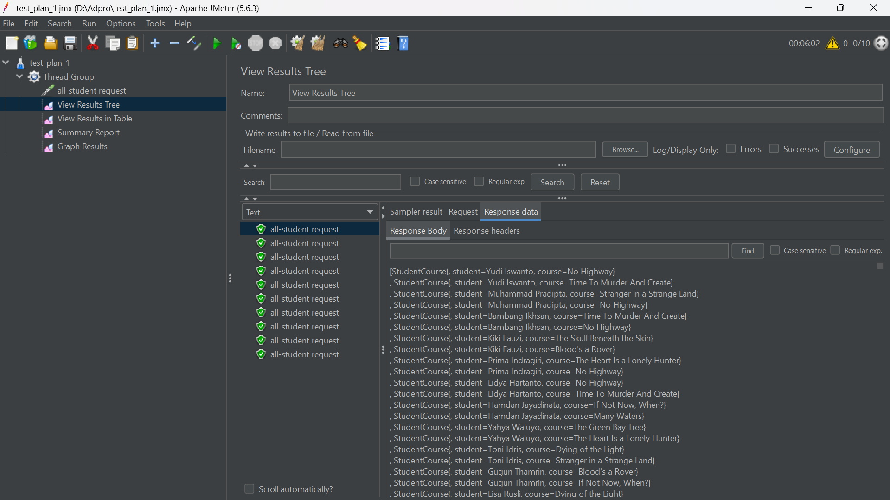

#### View Results in Table
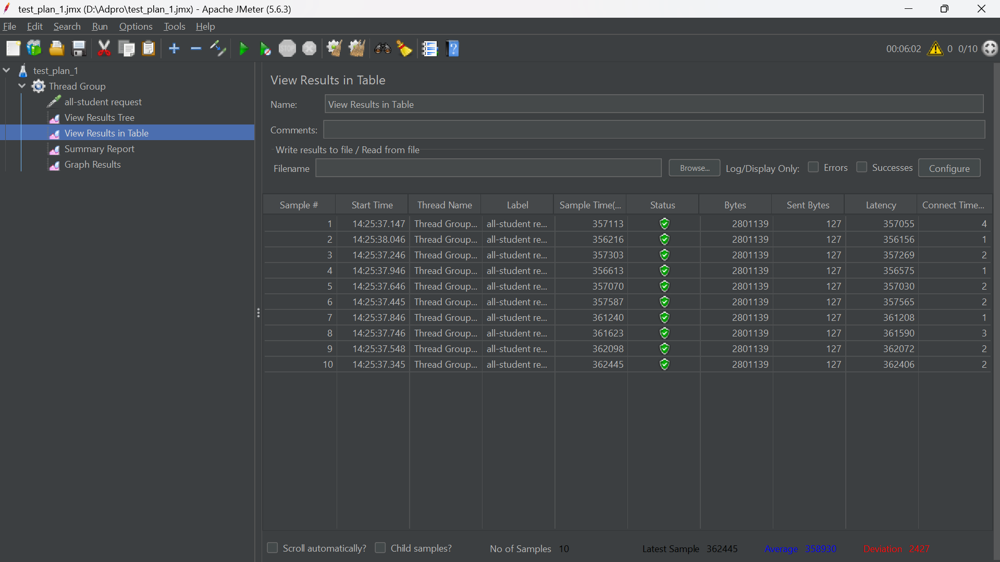

#### Summary Report
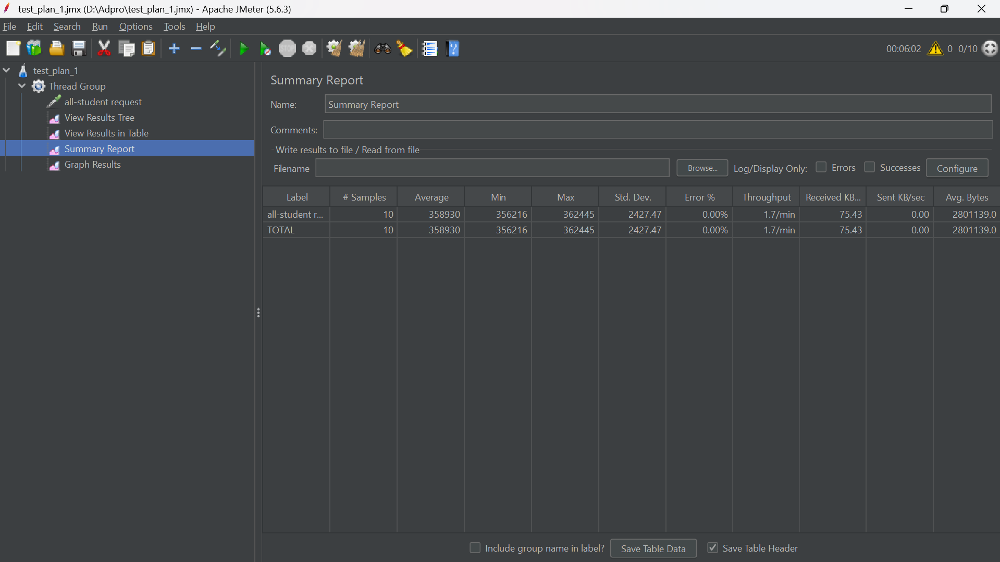

#### Graph Results
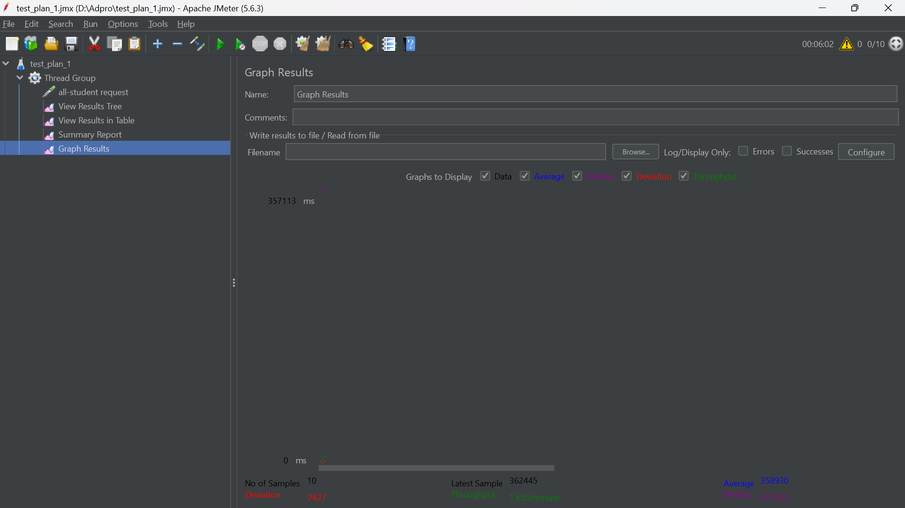

#### Cli test
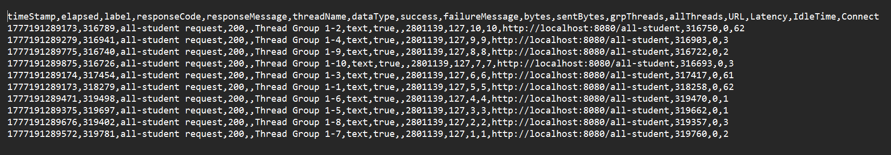

### all-student-name

#### View Results Tree
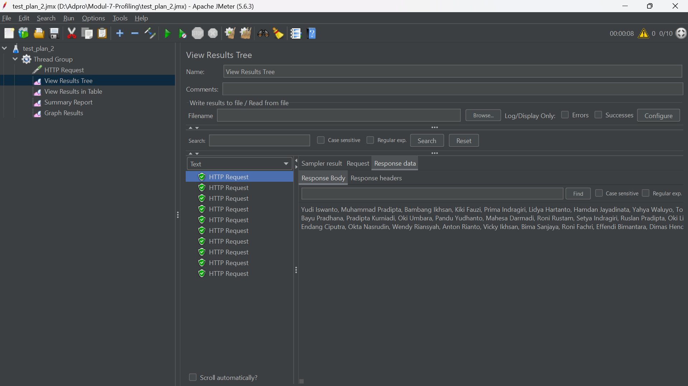

#### View Results in Table
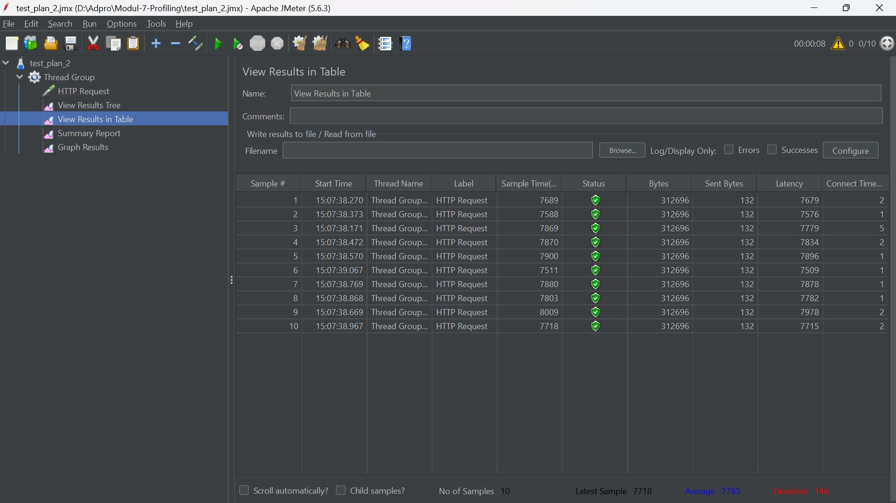

#### Summary Report

#### Graph Results

#### Cli test
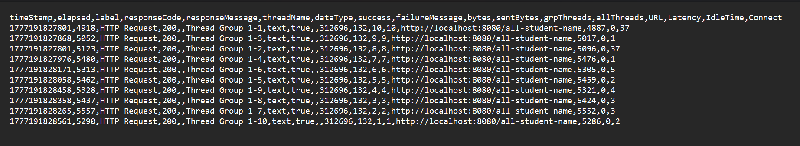

### highest-gpa

#### View Results Tree
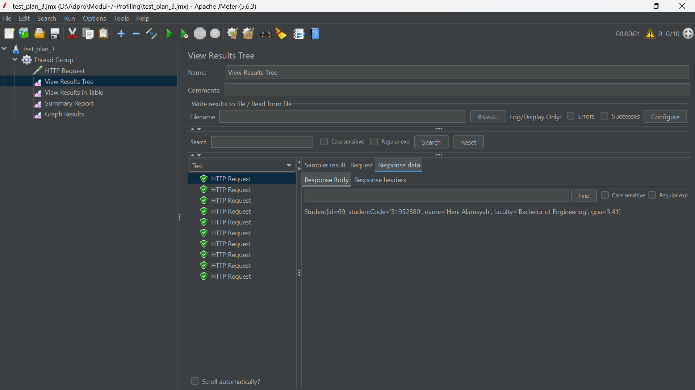

#### View Results in Table
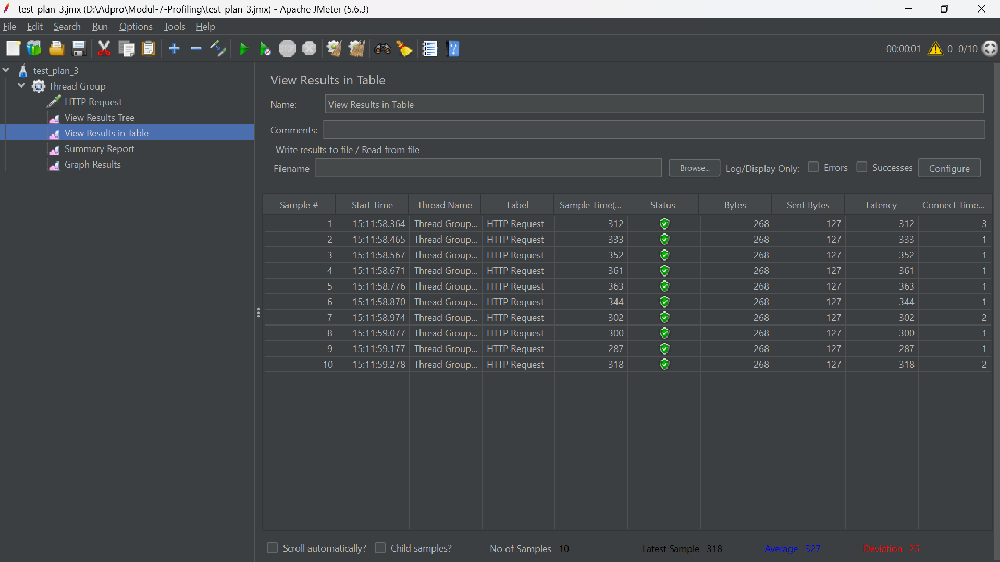

#### Summary Report
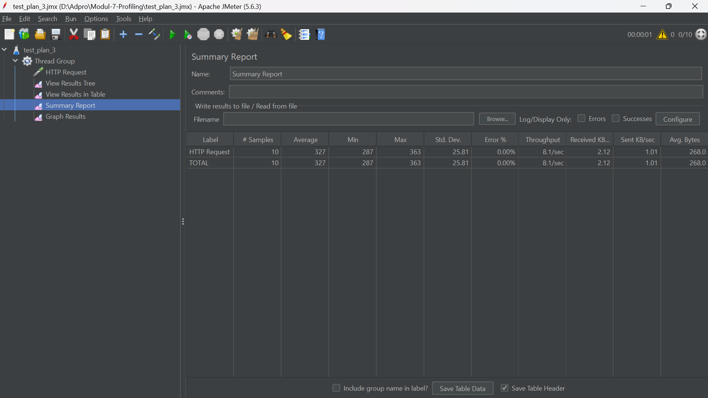

#### Graph Results
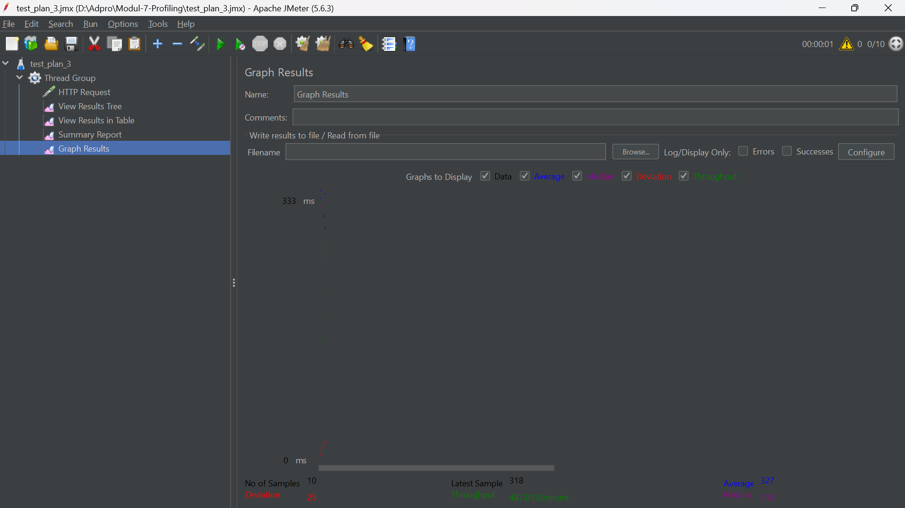

#### Cli test
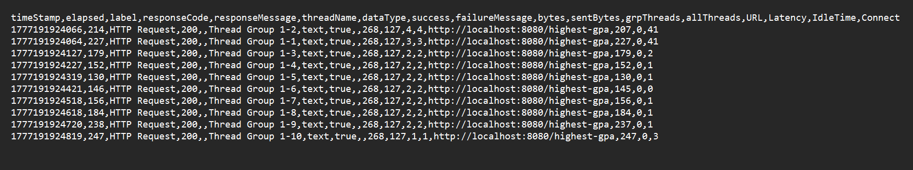

